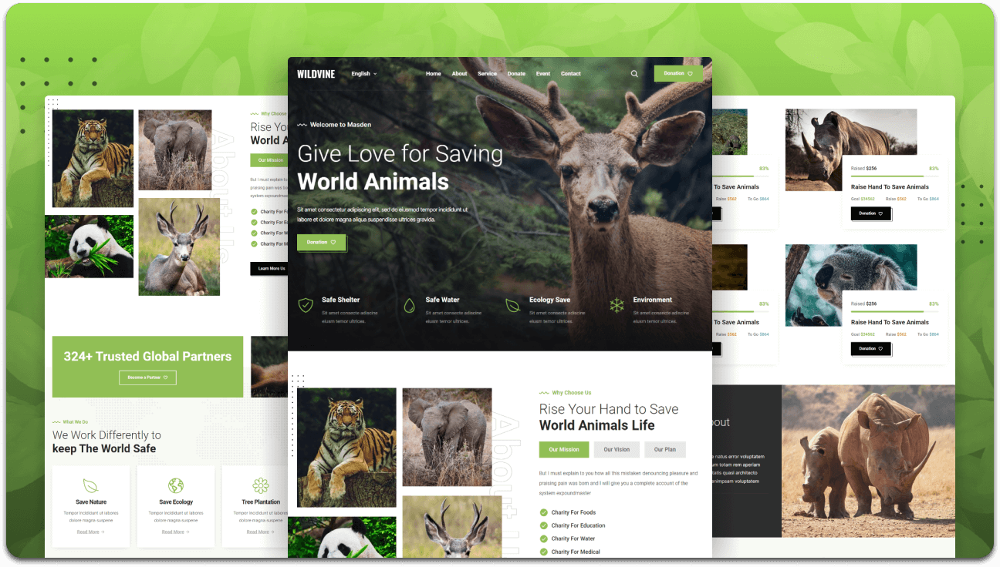

<div align="center">

  <h1>🌿 Wildvine - Charity Website</h1>

  <p>
    A fully responsive charity website built using <b>HTML, CSS, and JavaScript</b>.
  </p>

  <a href="https://upeka200163.github.io/Wildvine/">
    
  </a>

  <br/><br/>

  
  
  

</div>

---

## 📸 Demo Preview

<p align="center">
  
</p>

---

## 🚀 Features

- ✅ Fully Responsive Design (Mobile + Desktop)
- 🎨 Modern UI/UX Design
- ⚡ Fast and Lightweight
- 🌍 Charity-focused website structure
- 📱 Cross-browser compatibility

---

## 🛠️ Technologies Used

- HTML5  
- CSS3  
- JavaScript  

---

## 📂 Project Setup

### 🔽 Clone the repository

```bash
git clone : https://github.com/upeka200163/Wildvine.git
